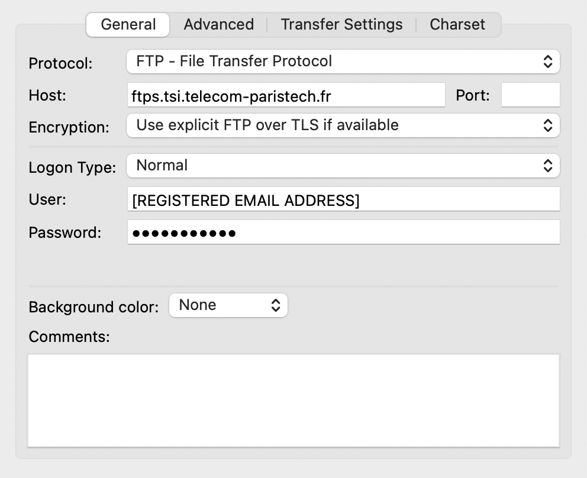
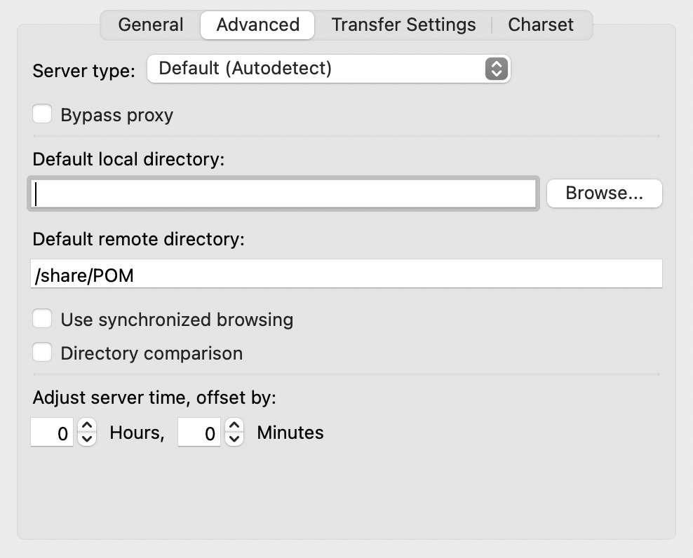

## Table of Contents <!-- omit in toc -->
- [Overview](#overview)
  - [Features](#features)
  - [Video labels](#video-labels)
  - [Words](#words)
  - [Opinion labels](#opinion-labels)
  - [Considerations](#considerations)
  - [Download Link](#download-link)
  - [Contact Information](#contact-information)
  - [Citation information](#citation-information)

## Overview

This dataset is an opinion annotated variant of the Persuasive Opinion Multimedia (POM) corpus. It was developed for the opinion prediction task and includes opinion annotations at two levels. The first annotation denotes the textual span of the opinion. The second annotation denotes the span of opinion components (e.g. holder, target, polarity). Further details can be found in ([Garcia et al. 2019 (1)](https://arxiv.org/abs/1902.10102)). As part of preprocessing, punctuation was added to the text of the original corpus. The dataset is stored as a pickled pandas [MultiIndex DataFrame](https://pandas.pydata.org/pandas-docs/stable/user_guide/advanced.html#hierarchical-indexing-multiindex).

The hierarchical index structure can be understood according to the array which forms the MultiIndex object. The first element of the index is one of the following values: 'features', 'labels', 'level_0', 'seq_level_labels_lvl1' or 'words'.

Each row in 'words' is indexed by the following tuple of values: ['index_text', 'id_sentence', 'level_1'] where 'index_text' indexes the raw filename for each movie review, 'id_sentence' indexes the sentences in the review, and 'level_1' indexes each word in each sentence. This array indexes the rows of each of the following pieces of data in the dataframe.

### Features

Features consist of the tuple ('features', [feature name], dimension) where the number of dimensions count the number of columns that comprise a particular feature.

| feature name          | feature type          | dimensions |
| --------------------- | --------------------- | ---------- |
| feature_COAVAREP      | audio                 | 43         |
| feature_FACET 4.1     | video                 | 43         |
| feature_FACET 4.2     | video                 | 36         |
| feature_glove_vectors | text                  | 300        |
| intervals             | word start, word stop | 2          |


### Video labels

Video labels consist of the tuple ('labels', [label name], dimension) where the number of dimensions count the number of columns that comprise a particular label.

| label name              | dimensions |
| ----------------------- | ---------- |
| label_video_personality | 16         |
| label_video_persuasion  | 1          |
| label_video_sentiment   | 1          |

### Words

Words consist of the tuple ('words', 'feature_words', 0).

### Opinion labels
Opinion labels consist of the tuple ('seq_level_labels_lvl1', 'seq_level_labels_lvl2', [label]). Labels consist of all holders, polarities, and targets in the dataset. Each label is boolean. The exception is the '4_levels_polarity' label which can take the values '0', '1', or '2'.

| labels                                |
| ------------------------------------- |
| 4_levels_polarity                     |
| Actor                                 |
| Atmosphere and mood                   |
| Character design                      |
| Composer - Singer - Soundmaker        |
| Director                              |
| Music and Sound effects               |
| Negative                              |
| Negative_levels                       |
| Neutral                               |
| Other                                 |
| Other people involved in movie making |
| Overall                               |
| Polarity                              |
| Positive                              |
| Positive_levels                       |
| Price                                 |
| Producer                              |
| Screenplay                            |
| Target                                |
| Token                                 |
| Very\\\\_Negative                     |
| Very\\\\_Positive                     |
| Vision and Special effect             |

### Considerations

Researcher should keep in mind that this dataset differs from the original POM dataset due to the follow data process:

1. Annotators did not take into account the video portion of the dataset during annotation. Only the transcripts of each review were considered.
2. While the original dataset contained punctuation (e.g. silent pauses), this dataset does not contain punctuation and only provides sentence segmentation. This could be of significant importance for those who want to use certain audio features from the CMU SDK -- such as pause ([Park et al. 2014](https://dl.acm.org/doi/pdf/10.1145/2663204.2663260)).
3. Because punctation has been removed the Levenshtein distance was used in order to re-match the annotated transcripts with the transcripts of the original dataset.
4. Finally the annotated transcripts were re-integrated with the remaining features in the original POM dataset.

### Download Link

The dataset is available for download through registration at the following link: 

http://service.tsi.telecom-paristech.fr/cgi-bin/user-service/subscribe.cgi?form=&license=1&ident=POM

If prompted to sign in simply click 'Cancel' in order to navigate to the registration page.

Filezilla is the recommended FTP client. Please make sure to use the following configuration when connecting to the server.




### Contact Information

Please direction any questions or concerns regarding this dataset to Ebenge Usip (ebenge.usip@telecom-paris.fr), Tanvi Dinkar (tanvi.dinkar@telecom-paris.fr) and Chloé Clavel (chloe;clavel@telecom-paris.fr).

### Citation information

```
@article{garcia2019multimodal,
  title={A multimodal movie review corpus for fine-grained opinion mining},
  author={Garcia, Alexandre and Essid, Slim and d'Alch{\'e}-Buc, Florence and Clavel, Chlo{\'e}},
  journal={arXiv preprint arXiv:1902.10102},
  year={2019}
}

@article{garcia2019token,
  title={From the token to the review: A hierarchical multimodal approach to opinion mining},
  author={Garcia, Alexandre and Colombo, Pierre and Essid, Slim and d'Alch{\'e}-Buc, Florence and Clavel, Chlo{\'e}},
  journal={arXiv preprint arXiv:1908.11216},
  year={2019}
}

@inproceedings{park2014computational,
  title={Computational analysis of persuasiveness in social multimedia: A novel dataset and multimodal prediction approach},
  author={Park, Sunghyun and Shim, Han Suk and Chatterjee, Moitreya and Sagae, Kenji and Morency, Louis-Philippe},
  booktitle={Proceedings of the 16th International Conference on Multimodal Interaction},
  pages={50--57},
  year={2014}
}
```


